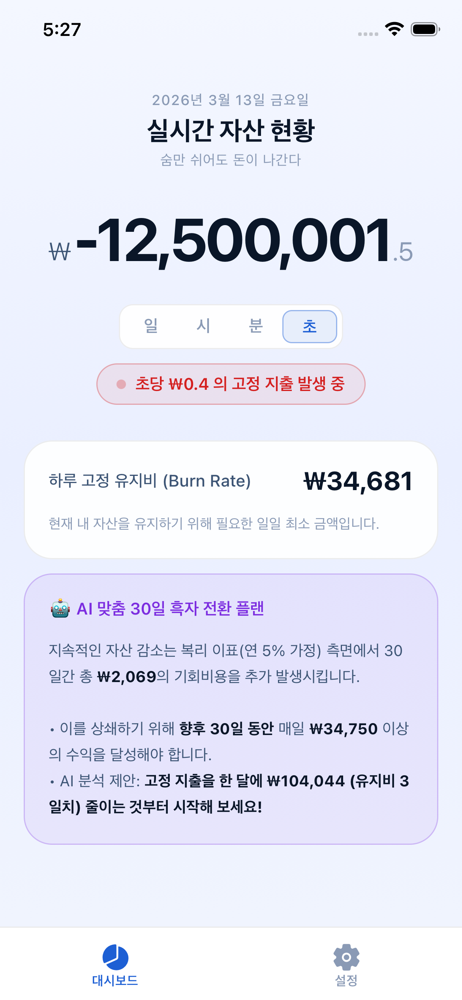
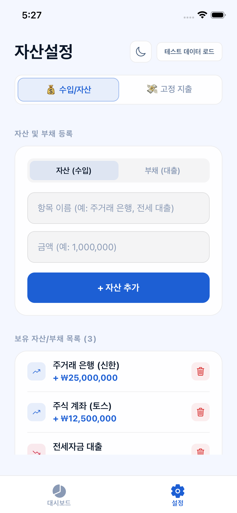
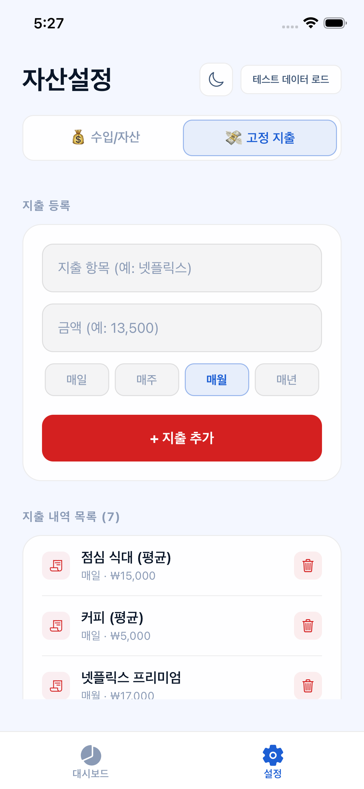
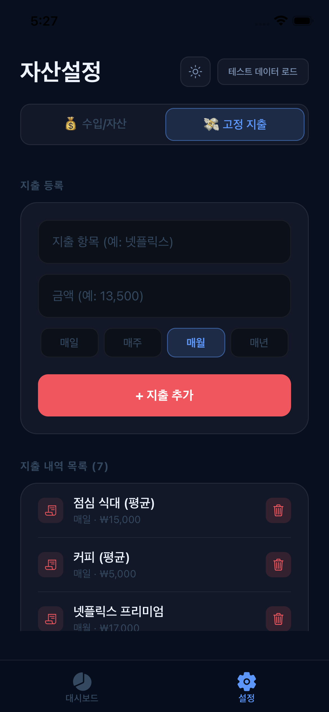
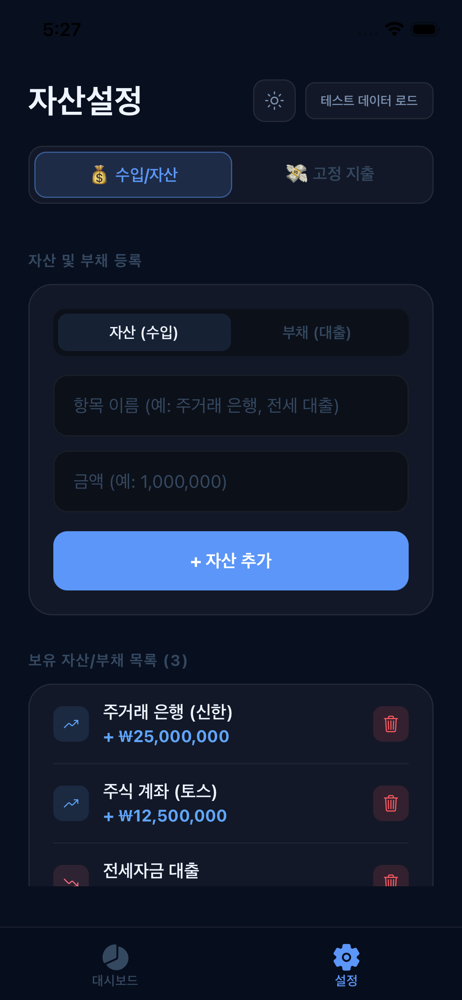
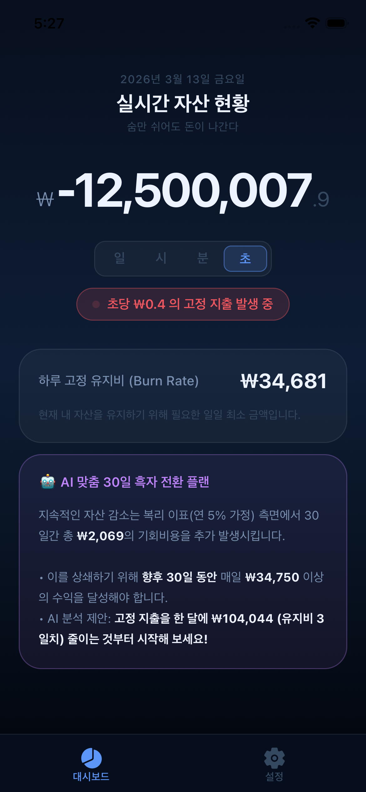
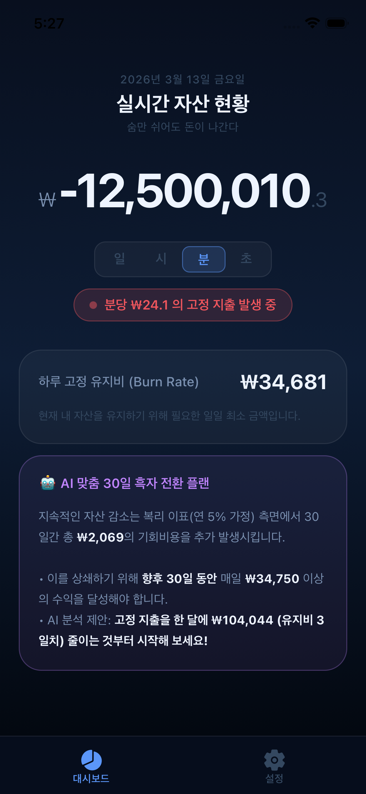
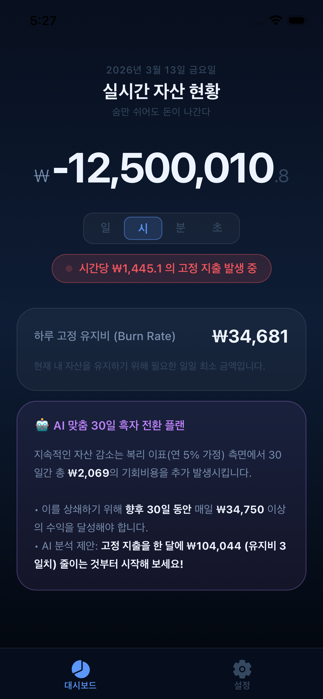
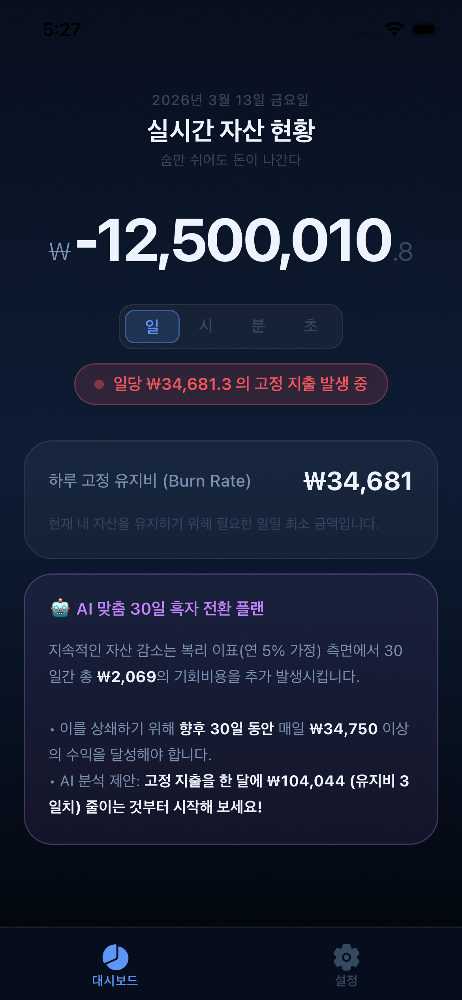

# Ohmymoney (오마이머니) 💸

> **"숨만 쉬어도 돈이 나간다"** — 실시간으로 줄어드는 내 순자산을 보며 소비 습관을 교정하는 리얼타임 자산 트래커입니다.

Ohmymoney는 단순한 가계부를 넘어, 사용자의 고정 지출을 기반으로 **초 단위로 깎여나가는 순자산(Burn Rate)** 을 시각화합니다. 돈을 쓰는 시점뿐만 아니라, 가만히 있어도 사라지는 기회비용과 유지비를 직관적으로 체감할 수 있도록 설계되었습니다.

## 📸 스크린샷 (Screenshots)

<p align="center">
  
  
  
  
  
</p>
<p align="center">
  
  
  
  
  
</p>

---

## 🚀 주요 기능

- **실시간 자산 티커 (Real-time Ticker)**: 설정된 번 레이트(Burn Rate)에 따라 순자산이 실시간으로 줄어드는 모습을 초 단위까지 시각화합니다.
- **번 레이트(Burn Rate) 분석**: 일/시/분/초 단위로 내 삶을 유지하는 데 드는 비용을 세밀하게 분석합니다.
- **자산 및 부채 관리**: 현재 보유한 현금, 주식 등 자산과 대출, 할부 등 부채를 구분하여 관리합니다.
- **고정 지출 설정**: 월 정기 구독, 관리비, 식비 등 반복되는 지출을 빈도별(일/주/월/년)로 등록할 수 있습니다.
- **🤖 AI 흑자 전환 플랜**: 현재 자산 상황과 지출 규모를 분석하여, 30일 이내에 흑자로 전환하기 위한 기회비용 계산 및 행동 전략을 제안합니다.
- **다크/라이트 모드**: 프리미엄한 사용자 경험을 위한 감각적인 테마 지원 및 애니메이션 효과.

## 🛠 기술 스택

- **Framework**: [Expo](https://expo.dev/) (SDK 54) / [React Native](https://reactnative.dev/)
- **Routing**: [Expo Router](https://docs.expo.dev/router/introduction/) (File-based)
- **State Management**: [Zustand](https://github.com/pmndrs/zustand) (v5)
- **Database**: [expo-sqlite](https://docs.expo.dev/versions/latest/sdk/sqlite/) (Local-first)
- **Animation**: [React Native Reanimated](https://docs.expo.dev/versions/latest/sdk/reanimated/)
- **Icons**: [Ionicons (@expo/vector-icons)](https://icons.expo.fyi/)

## 🏃 시작하기

### 1. 의존성 설치
```bash
npm install
```

### 2. 개발 서버 실행
```bash
npx expo start
```

### 3. 안드로이드 APK 빌드 (Release)
로컬 환경에서 직접 APK를 추출하려면 아래 명령어를 사용하세요:
```bash
npx expo prebuild -p android --clean
cd android && ./gradlew assembleRelease
```
*결과물 경로: `android/app/build/outputs/apk/release/app-release.apk`*

---

## 📂 프로젝트 구조

- `app/`: 라우팅 및 화면 컴포넌트 (Dashboard, Settings)
- `src/store/`: Zustand 기반 금융 상태 관리 및 계산 로직
- `src/db/`: SQLite 테이블 초기화 및 CRUD 헬퍼
- `constants/`: 테마 및 금융 계산 상수
- `hooks/`: 테마 및 공통 훅

---

## 📄 라이선스

이 프로젝트는 개인 학습 및 자산 관리 목적으로 제작되었습니다.
